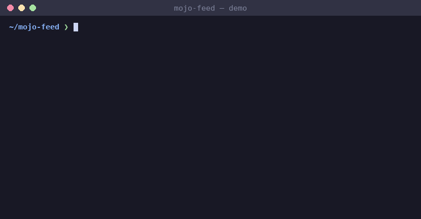

<div align="center">

# mojo-feed

**RSS, Atom, and JSON Feed parsing in pure Mojo. No Python dependencies, no FFI.**

[](LICENSE)
[](https://mojolang.org)
[](https://chainofthought.show)
[](https://x.com/ConorBronsdon)



</div>

As of mid-2026 the Mojo ecosystem had JSON, TOML, CSV, and YAML parsers — but
nothing for RSS, Atom, or XML. mojo-feed fills the feed-shaped slice of that
gap: a minimal non-validating XML pull parser with RSS/Atom mapping and a
JSON Feed parser on top. I built it to watch my own podcast's feed; it works
on any feed a podcast host or blog emits. (That same pull parser later grew
into [mojo-xml](https://github.com/conorbronsdon/mojo-xml), a general-purpose
`xml.etree.ElementTree`-shaped library.)

## What it handles

- Every syndication format in real use, auto-detected: RSS 0.91/0.92,
  RSS 1.0/0.90 (RDF root, items as channel siblings, `dc:date`,
  `rdf:about` identity), RSS 2.0, Atom 1.0, and JSON Feed 1.0/1.1
- Structured dates: `item.date()` parses RFC 822 (`pubDate`) and
  RFC 3339/ISO 8601 (Atom, JSON Feed) into a `FeedDate` with civil
  fields, UTC offset (named zones included), and `unix_timestamp()`
- Fetching: `fetch_feed(url)` pulls and parses in one call (via the
  system `curl` until the ecosystem grows an HTTP client)
- Namespaces resolved by URI, not literal prefix: iTunes/Dublin
  Core/content/Media RSS/Podcast Index elements map even when the
  document binds them to a nonstandard prefix
- CDATA sections, comments, processing instructions, DOCTYPE
- Predefined entities (`&amp;`, `&lt;`, …) and numeric character references
  (`&#8217;`, `&#x26;`), with correct multi-byte UTF-8 output
- Media enclosures three ways: RSS `<enclosure>`, Atom
  `<link rel="enclosure">`, and Media RSS `<media:content>` /
  `<media:description>` (YouTube, Feedburner)
- Encoding normalization from raw bytes (`parse_feed_bytes`): UTF-16
  LE/BE transcoding, UTF-8 BOM stripping, declared
  `ISO-8859-1`/`Windows-1252` conversion, and lossy U+FFFD recovery
  for invalid UTF-8 — mojibake never propagates
- Excerpt and full body as separate fields (`description` and `content`)
  when the feed provides both, WordPress/Substack style
- Atom `<author><name>` nesting
- Messy real-world feeds: unknown and malformed entities pass through
  instead of failing the document, and unbalanced markup (a bare `<br>`
  in a non-CDATA description, crossed or stray tags) is recovered from
  instead of corrupting the rest of the parse

## What it deliberately does NOT do

- **General XML validation.** `strict` mode checks feed well-formedness for
  debugging, but DTD/schema validation and full spec-conformance XML belong in
  [mojo-xml](https://github.com/conorbronsdon/mojo-xml) — a general-purpose
  `xml.etree.ElementTree`-shaped library that grew out of this library's pull
  parser.
- **Full lexically-scoped namespace resolution.** Prefix bindings are
  collected document-flat (feeds declare them on the root); a document that
  rebinds the same prefix to different URIs mid-stream resolves to the
  last binding seen.
- **Speak HTTP natively.** `fetch_feed` shells out to `curl`; pass bytes
  from any other transport to `parse_feed_bytes`.

## Install

With [pixi](https://pixi.prefix.dev):

```bash
pixi install
pixi run test
pixi run demo
```

Or with uv:

```bash
uv venv
uv pip install mojo --index https://whl.modular.com/nightly/simple/ --prerelease allow
.venv/bin/mojo run -I src test/test_feed.mojo
```

Requires a Mojo nightly (`>=1.0.0b3`).

## Usage

```mojo
from feed import parse_feed, fetch_feed

def main() raises:
    # From a URL (uses the system curl):
    var live = fetch_feed("https://feeds.transistor.fm/chain-of-thought")
    print(live.title, len(live.items))

    # From a file or any string/bytes you already have:
    var feed = parse_feed(open("feed.xml", "r").read())
    for item in feed.items:
        var when = item.date()          # structured FeedDate
        print(when.unix_timestamp(), item.title, item.enclosure_url)
```

Every `FeedItem` carries `title`, `link`, `description` (excerpt), `content`
(full body), `pub_date`, `guid`, `author`, `enclosure_url` /
`enclosure_type` / `enclosure_length`, `duration`, and `episode_number`.
Empty string means the feed didn't provide the field.

### Strict mode: debug the feed you produce

Default parsing is liberal — right for feeds you consume. When the feed is
*yours* and you want to know why other readers choke on it, `strict=True`
turns error recovery into diagnostics with line/column locations:

```mojo
var feed = parse_feed(source^, strict=True)
# => mojo-feed [strict]: mismatched end tag </item>, expected </title>
#    (line 214, column 9)
```

Or from the command line:

```bash
pixi run validate my-feed.xml
# OK: rss feed, 66 items, no violations
```

Strict mode catches mismatched/stray end tags, elements left open at EOF,
unknown entities, and bare `&`. A feed that passes strict mode isn't relying
on any reader's error recovery. (Location tracking is computed only on the
error path — liberal parsing pays nothing for it.)

For other XML, drop down to the pull parser:

```mojo
from feed import XmlPullParser, EVENT_START, EVENT_EOF

var parser = XmlPullParser(source^)
while True:
    var event = parser.next_event()
    if event.kind == EVENT_EOF:
        break
    if event.kind == EVENT_START:
        print(event.name, len(event.attrs))
```

## Design notes

- **Pull parser, not DOM.** One pass over the bytes, no tree allocation; the
  feed layer keeps only an open-element name stack and the current item.
- **Empty string = absent field.** No `Optional` in the model for v0.1.
- **Liberal by default.** Feeds in the wild are not valid XML. Malformed
  entities and unknown names degrade gracefully instead of raising.

## Limitations worth knowing

- Mixed-content text (e.g. Atom `type="xhtml"` bodies) is kept in full, but
  text nodes are concatenated with only the whitespace the document itself
  contains — inline tags contribute no separators.

## Tests & benchmarks

```bash
pixi run test
pixi run bench
```

70 tests across four files: the XML tokenizer (30, including encodings
and strict mode), the mapping layer + JSON Feed (19), date parsing (11),
and integration
passes (10) against eight real feed snapshots — a 547 KB Transistor
podcast feed (66 episodes, itunes namespaces, CDATA, stylesheet PI), an
811 KB Substack feed, Hacker News front-page RSS, the xkcd Atom feed, a
YouTube channel feed (Media RSS), a WordPress feed, Slashdot's RSS 1.0
RDF feed (declared ISO-8859-1), and a real JSON Feed. One integration
test round-trips every date in every fixture through `parse_date` and
sanity-checks the timestamps.

Robustness is validated two ways. A 144-feed public OPML corpus
(`test/corpus_run.py`): **all 138 fetchable feeds parse fully** — the
three flagged for empty titles turned out to have literal
`<title></title>` in their source. And fuzzing (`test/fuzz_drive.py`):
5,400+ mutated documents (byte flips, truncations, chunk splices,
hostile tokens, XML and JSON seeds) with zero crashes and zero hangs —
malformed input either parses liberally or raises a clean error. Hostile
inputs are bounded: JSON nesting is depth-capped, out-of-range
codepoints become U+FFFD, and `fetch_feed` rejects URLs that could
escape shell quoting.

Compiled throughput on the real fixtures: 131–146 MB/s (~4.0 ms for the
547 KB feed; run `pixi run bench` to reproduce on your machine). Parse
time is dwarfed by fetch time in any real workload; if you're parsing
feeds at bulk-pipeline scale and want more, a zero-copy event API
(events referencing source spans instead of owning strings) is the
well-scoped next step — open an issue.

## Part of a pure-Mojo library suite

Eleven pure-Mojo libraries that mirror familiar Python stdlib and PyPI APIs,
filling gaps in the native Mojo ecosystem:

- [mojo-xml](https://github.com/conorbronsdon/mojo-xml) — general-purpose XML
  parsing, an ElementTree-shaped DOM (Python's `xml.etree.ElementTree`)
- [mojo-captions](https://github.com/conorbronsdon/mojo-captions) — SRT and
  WebVTT subtitle/transcript parsing (no Python stdlib parallel)
- [mojo-html](https://github.com/conorbronsdon/mojo-html) — HTML parsing and
  article extraction (Python's readability)
- [mojo-markdown](https://github.com/conorbronsdon/mojo-markdown) —
  CommonMark markdown parsing (Python's `markdown`)
- [mojo-unicodedata](https://github.com/conorbronsdon/mojo-unicodedata) —
  Unicode normalization and case folding (Python's `unicodedata`)
- [mojo-diff](https://github.com/conorbronsdon/mojo-diff) — text diffing
  (Python's `difflib`)
- [mojo-template](https://github.com/conorbronsdon/mojo-template) — a
  Jinja-flavored template engine (Python's `jinja2`)
- [mojo-tar](https://github.com/conorbronsdon/mojo-tar) — tar archive
  reading and writing (Python's `tarfile`)
- [mojo-redis](https://github.com/conorbronsdon/mojo-redis) — a Redis
  client (Python's `redis-py`)
- [mojo-url](https://github.com/conorbronsdon/mojo-url) — URL parsing
  and encoding (Python's `urllib.parse`)

## Contributing

Issues and PRs welcome — especially real-world feeds that parse wrong (attach
the feed URL or a snippet) and Atom coverage gaps. Run `pixi run test` before
sending a PR.

## About

Built by [Conor Bronsdon](https://conorbronsdon.com) — host of
[Chain of Thought](https://chainofthought.show), a podcast about AI agents,
infrastructure, and engineering. This library's integration fixture is that
show's own RSS feed. Find me on [X](https://x.com/ConorBronsdon) or
[LinkedIn](https://www.linkedin.com/in/conorbronsdon).


---

## Disclaimer

*All views, opinions, and statements expressed on this account/in this repo are solely my own and are made in my personal capacity. They do not reflect, and should not be construed as reflecting, the views, positions, or policies of Modular. This account is not affiliated with, authorized by, or endorsed by my employer in any way.*

## License

Licensed under the [MIT License](LICENSE).
